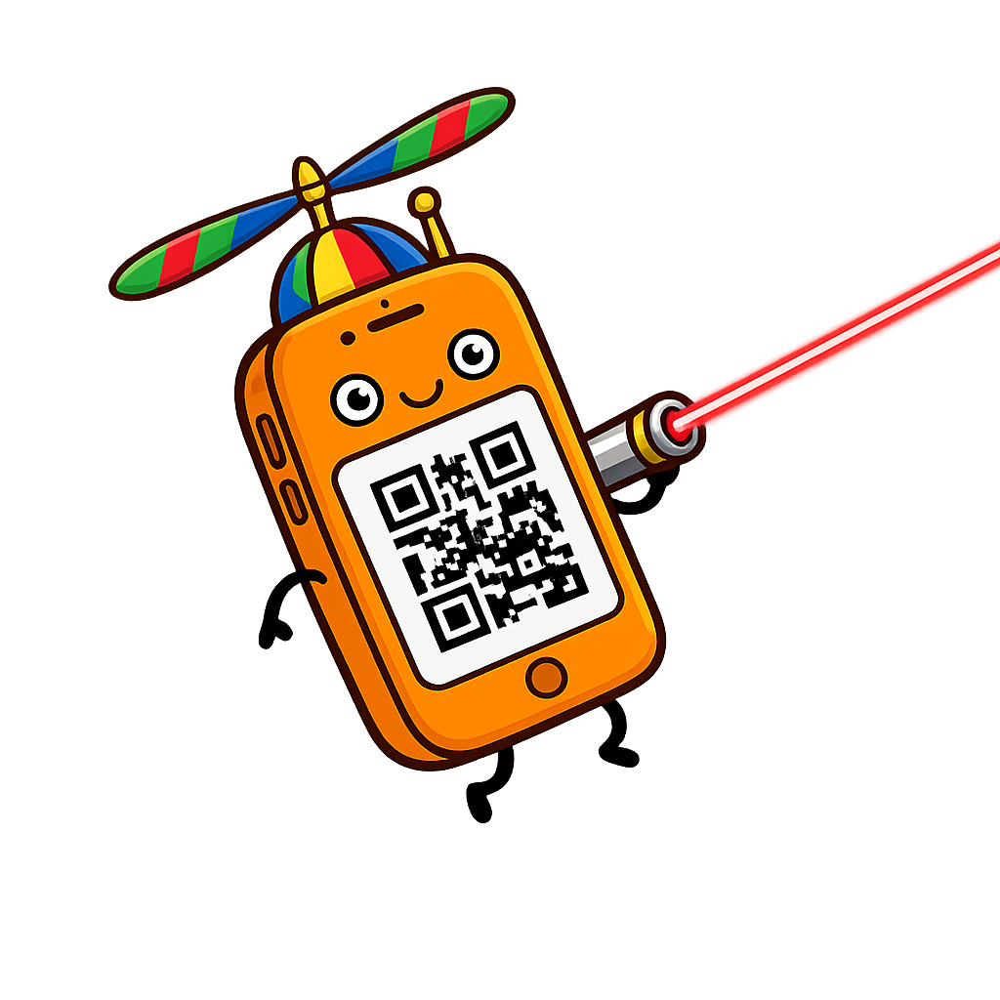

<br/>
<div align="center">
  <a href="" rel="noopener">
  </a>
</div>
<br/>
<div align="center">

# Gyroclopter

Point your phone, and then point your phone.

[](http://github.com/ryanraposo/LoveItShipIt)

</div>

## Quick Install

### Windows
Download the latest installer from [Releases](https://github.com/ryanraposo/gyroclopter/releases), run it, and launch Gyroclopter from the Start Menu.

### Linux
Download the latest `.deb` from [Releases](https://github.com/ryanraposo/gyroclopter/releases) and install:
```bash
sudo dpkg -i gyroclopter_*.deb
```

Then launch from your applications menu.

### macOS
Coming soon!

---

## Development Setup

### 1. Clone and install
```bash
git clone https://github.com/ryanraposo/gyroclopter.git
cd gyroclopter
npm install
```

### 2. Linux: install mouse tools
**X11:**
```bash
sudo apt install xdotool
```

**Wayland:**
```bash
sudo apt install ydotool
```

### 3. Run
```bash
npm start
```

Scan the QR code with your phone, accept the certificate warning, grant motion permission, and calibrate.

---

## Build

```bash
# Build both Windows and Linux installers
npm run build

# Or build for specific platforms:
npm run build:win    # Windows installer (.exe)
npm run build:linux  # Linux package (.deb)
```

**Requirements:**
- **Linux builds:** No extra dependencies
- **Windows builds (from Linux):** Requires Wine (`sudo apt install wine64`)

Produces:
- `dist/Gyroclopter Setup *.exe` (Windows NSIS installer, ~75 MB)
- `dist/gyroclopter_*.deb` (Linux Debian package, ~71 MB)

---

## Changelog Generation

Automatically generate `CHANGELOG.md` from conventional commit messages:

```bash
# Install changelog generator (one-time)
npm install

# Update changelog with recent commits
npm run changelog

# Regenerate entire changelog from scratch
npm run changelog:all

# Or use the shell script
./scripts/changelog.sh
./scripts/changelog.sh v0.5.0  # with version tag
```

### Conventional Commit Format

Commits should follow the [Conventional Commits](https://www.conventionalcommits.org/) spec:

```
feat: add scroll support
fix: correct mouse sensitivity
docs: update README build instructions
refactor: simplify server startup
```

The changelog automatically categorizes commits into:
- **Features** (`feat:`)
- **Bug Fixes** (`fix:`)
- **Code Refactoring** (`refactor:`)
- **Documentation** (`docs:`)
- **Build System** (`build:`)
- **Tests** (`test:`)
- And more...

GitHub Actions will auto-update the changelog on version tag pushes.

---

## Usage

1. Launch Gyroclopter
2. Click **Start Server**
3. Scan QR code or open URL on phone
4. Accept self-signed certificate warning
5. Tap **Allow & Connect** (grant motion permission)
6. Tap **Calibrate** while pointing at cursor
7. Tilt phone to move, use buttons for clicks/scroll

Window minimizes to tray; quit from tray to stop server.

---

## Mobile Controls

| Control            | Action                                     |
|--------------------|--------------------------------------------|
| Tilt phone         | Move cursor                                |
| Tap main pad       | Toggle motion on/off                       |
| Hold **LEFT**      | Left mouse button down/up                  |
| Tap **RIGHT**      | Right-click                                |
| Swipe **SCROLL**   | Scroll up/down                             |
| Sensitivity slider | Adjust speed (1–25)                        |

---

## Configuration

Edit `server.js` to change defaults:
```js
const CONFIG = {
    PORT: 8443,
    APP_DIR: path.join(os.tmpdir(), 'gyroclopter'),
    MOUSE_SENSITIVITY_MULTIPLIER: 1.2
};
```

| Env Variable | Description                                      |
|--------------|--------------------------------------------------|
| `CERT_DIR`   | Cert directory (default: OS temp)               |
| `IS_CHILD`   | Windows: spawn visible console                  |

---

## Troubleshooting

**Phone can't connect**  
→ Same Wi‑Fi network? Port 8443 open?

**Permission denied**  
→ Tap **Allow & Connect** on iOS when prompted

**Certificate warning**  
→ Expected. Mobile requires HTTPS for motion sensors.

**Linux mouse doesn't move**  
→ Install `xdotool` (X11) or `ydotool` (Wayland)

---

## Testing

```bash
npm test
```

Runs Jest suite in `tests/`.

---

## Project Structure

```
gyroclopter/
├── app/                    # Desktop UI
│   ├── main.js             # Electron main process
│   ├── index.html          # UI (QR, status, controls)
│   └── style.css
├── server.js               # HTTPS/WSS server + mouse
├── client.html             # Mobile UI
├── tests/                  # Jest tests
├── build-icon.js           # Icon generator
└── package.json
```

---

## Contributing

1. Fork
2. Branch: `git checkout -b feature/xyz`
3. Code + tests
4. Verify: `npm test`
5. PR with description

Style: CommonJS, 2-space indent, clear commits.

---

## License

[ISC](https://opensource.org/licenses/ISC)